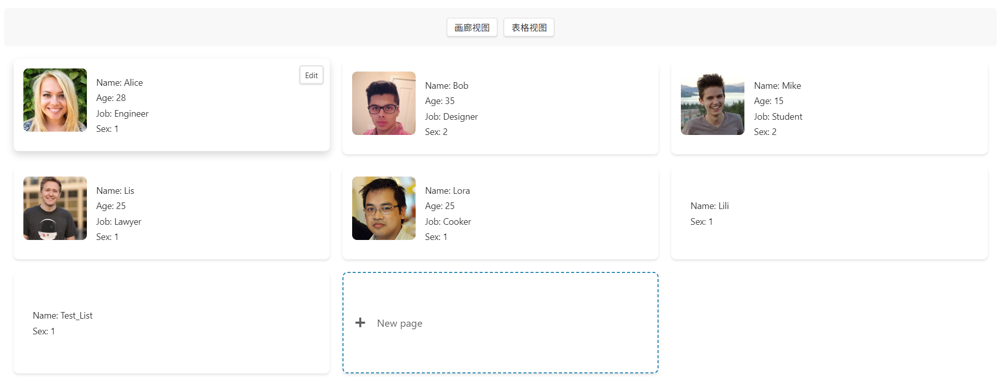
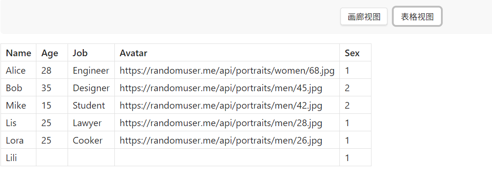
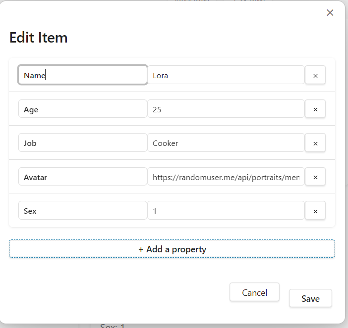
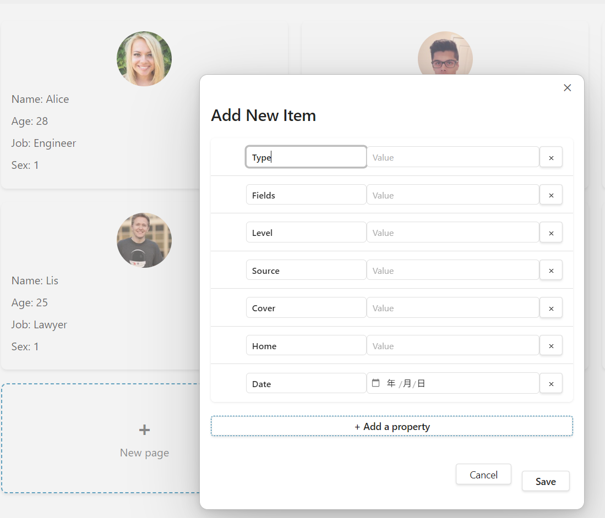

# Gallery JSON Obsidian 插件介绍

- [English](README.md)
- [简体中文](README.zh-CN.md)

An Obsidian plugin similar to Notion Gallery-view. This plugin transforms JSON data into beautiful, interactive gallery views and lists. This plugin is designed for data visualization enthusiasts based on demand, allowing you to create dynamic galleries directly from JSON files or sample data.

Rendering of large-scale data is not performed, as this plugin saves the data in the current file, making it unsuitable for rendering large-scale data.

# Current Features
1. 🖼️ ​​Gallery View: Visualize JSON items as customizable cards with images and metadata


2.📊 ​List View: Display data in a structured table


3.✏️ Interactive Editing: Click on any card to edit properties in a user-friendly form


4.➕ ​​Add New Item: Easily create new gallery items via the intuitive "New Page" card


# ​Use Cases

- Create a character gallery for an RPG game
- Build product catalogs and portfolios
- Visualize datasets and research collections
- Manage a contact directory with photos
- Organize a media library with metadata

# ​Quick start
There are two ways to display the gallery:
1. Run the "Create Gallery from JSON File" command to open the JSON file;
The JSON file to be opened needs to be in Values;
Opening will render it as a region block;
2. Use the region block directly;
````gallery-json
[
  {
    "Name": "Alice",
    "Age": 28,
    "Job": "Engineer",
    "Avatar": "https://randomuser.me/api/portraits/women/68.jpg",
    "Sex": "1"
  },
  {
    "Name": "Bob",
    "Age": 35,
    "Job": "Designer",
    "Avatar": "https://randomuser.me/api/portraits/men/45.jpg",
    "Sex": "2"
  },
  {
    "Name": "Mike",
    "Age": 15,
    "Job": "Student",
    "Avatar": "https://randomuser.me/api/portraits/men/42.jpg",
    "Sex": "2"
  },
  {
    "Name": "Lis",
    "Age": 25,
    "Job": "Lawyer",
    "Avatar": "https://randomuser.me/api/portraits/men/28.jpg",
    "Sex": "1"
  },
  {
    "Name": "Lora",
    "Age": 25,
    "Job": "Cooker",
    "Avatar": "https://randomuser.me/api/portraits/men/26.jpg",
    "Sex": "1"
  },
  {
    "Name": "Lili",
    "Sex": "1"
  }
]
````

This plugin provides a simple way to visualize and interact with structured data while maintaining the flexibility of Markdown and JSON.
