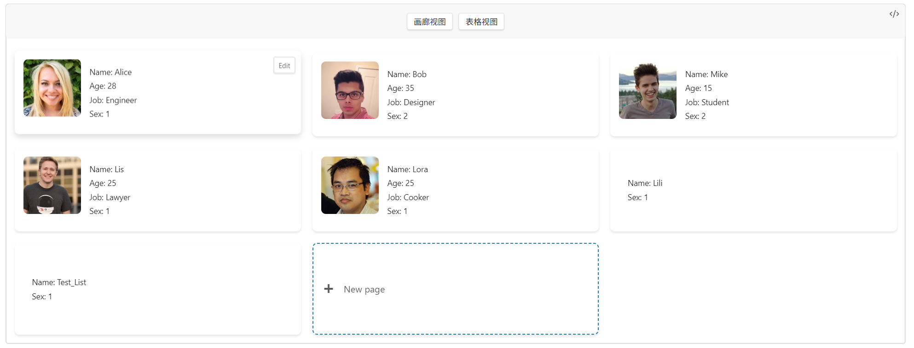

# Gallery JSON Obsidian 插件介绍
一种类似Notion Gallery-view的Obsidian插件。本插件是一种能够将 JSON 数据转化为精美的交互式画廊视图和列表。本插件从需求出发，专为数据可视化爱好者设计，让您可以直接从 JSON 文件或示例数据创建动态画廊。

未执行大规模数据的渲染，因为本插件会将数据保存在当前文件中，因此应该不适用于大规模数据的渲染。

​# 当前的​核心功能

1. 🖼️ ​​画廊视图​​：将 JSON 项目可视化为可自定义的卡片，包含图片和元数据


2.📊 ​列表视图​​：在结构化表格中展示数据


3.✏️ ​​交互式编辑​​：点击任意卡片即可在用户友好的表单中编辑属性

4.➕ ​​添加新项目​​：通过直观的"新建页面"卡片轻松创建新画廊项目


​# ​使用场景：​​

- 为 RPG 游戏创建角色画廊
- 构建产品目录和作品集
- 可视化数据集和研究集合
- 管理带照片的联系人目录
- 整理带元数据的媒体库

​# ​快速开始：​​
可以通过两种方式进行画廊展示：
1. 运行"Create Gallery from JSON File"命令打开JSON文件；
  需要打开的JSON文件需要在Values中；
  打开会会被渲染为区域块形式；
2. 直接使用区域块；
````gallery-json
[
  {
    "Name": "Alice",
    "Age": 28,
    "Job": "Engineer",
    "Avatar": "https://randomuser.me/api/portraits/women/68.jpg",
    "Sex": "1"
  },
  {
    "Name": "Bob",
    "Age": 35,
    "Job": "Designer",
    "Avatar": "https://randomuser.me/api/portraits/men/45.jpg",
    "Sex": "2"
  },
  {
    "Name": "Mike",
    "Age": 15,
    "Job": "Student",
    "Avatar": "https://randomuser.me/api/portraits/men/42.jpg",
    "Sex": "2"
  },
  {
    "Name": "Lis",
    "Age": 25,
    "Job": "Lawyer",
    "Avatar": "https://randomuser.me/api/portraits/men/28.jpg",
    "Sex": "1"
  },
  {
    "Name": "Lora",
    "Age": 25,
    "Job": "Cooker",
    "Avatar": "https://randomuser.me/api/portraits/men/26.jpg",
    "Sex": "1"
  },
  {
    "Name": "Lili",
    "Sex": "1"
  }
]
````


该插件简单提供了一种可视化交互结构化数据的方式，同时保持了 Markdown 和 JSON 的灵活性。